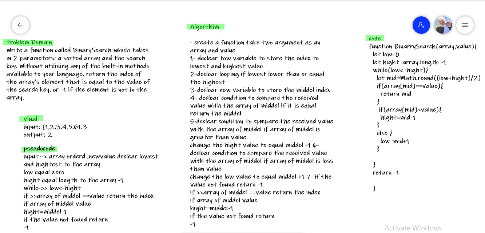

# Binary Search of Sorted Array
<!-- Description of the challenge -->
Write a function called BinarySearch which takes in 2 parameters: a sorted array and the search key. Without utilizing any of the built-in methods available to your language, return the index of the array’s element that is equal to the value of the search key, or -1 if the element is not in the array.

## Whiteboard Process

## Approach & Efficiency
<!-- What approach did you take? Discuss Why. What is the Big O space/time for this approach? -->

- create a function take two argument as an array and value
- iterrate throw the array and check if the element in the array equale to the value if yes return the index of this elemnt if not return -1

**- O(logn)**