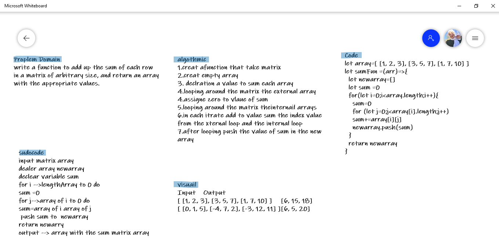

# Binary Search of Sorted Array
<!-- Description of the challenge -->
Proplem Domain
write a function to add up the sum of each row in a matrix of arbitrary size, and return an array with the appropriate values.

## Whiteboard Process

## Approach & Efficiency
<!-- What approach did you take? Discuss Why. What is the Big O space/time for this approach? -->

algothmic 
1. creat afunction that take matrix 
2. creat empty array
3. declration a value to sum each array 
4. looping around the matrix the external array
4. assigne zero to vlaue of sum 
5. looping around the matrix theinternail arrays
6. in each itrate add to value sum the index value from the xternal loop and the internal loop
7. after looping push the value of sum in the new array

