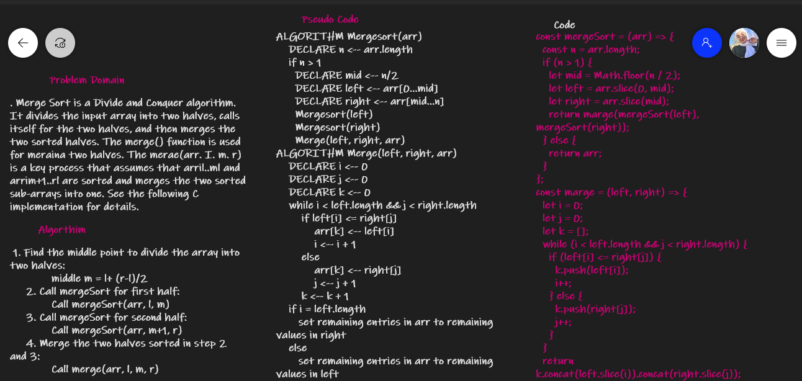
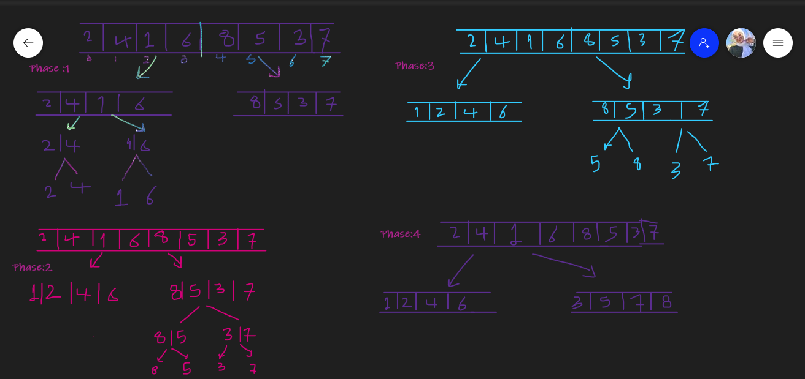
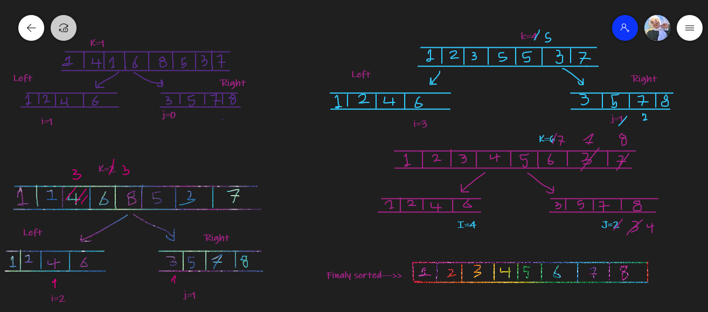

# Challenge Summary
<!-- Description of the challenge -->

## Whiteboard Process
<!-- Embedded whiteboard image -->


**ALGORITHM Mergesort**

```
ALGORITHM Mergesort(arr)
    DECLARE n <-- arr.length

    if n > 1
      DECLARE mid <-- n/2
      DECLARE left <-- arr[0...mid]
      DECLARE right <-- arr[mid...n]
      // sort the left side
      Mergesort(left)
      // sort the right side
      Mergesort(right)
      // merge the sorted left and right sides together
      Merge(left, right, arr)

```



**ALGORITHM Merge(left, right, arr)**

```
ALGORITHM Merge(left, right, arr)
    DECLARE i <-- 0
    DECLARE j <-- 0
    DECLARE k <-- 0

    while i < left.length && j < right.length
        if left[i] <= right[j]
            arr[k] <-- left[i]
            i <-- i + 1
        else
            arr[k] <-- right[j]
            j <-- j + 1

        k <-- k + 1

    if i = left.length
       set remaining entries in arr to remaining values in right
    else
       set remaining entries in arr to remaining values in left
```



## Approach & Efficiency
<!-- What approach did you take? Why? What is the Big O space/time for this approach? -->

**Time complexity of Merge Sort is  θ(nLogn)**

Merge Sort is a Divide and Conquer algorithm. It divides the input array into two halves, calls itself for the two halves, and then merges the two sorted halves. The merge() function is used for merging two halves. The merge(arr, l, m, r) is a key process that assumes that arr[l..m] and arr[m+1..r] are sorted and merges the two sorted sub-arrays into one. See the following C implementation for details

```
MergeSort(arr[], l,  r)
If r > l
     1. Find the middle point to divide the array into two halves:  
             middle m = l+ (r-l)/2
     2. Call mergeSort for first half:   
             Call mergeSort(arr, l, m)
     3. Call mergeSort for second half:
             Call mergeSort(arr, m+1, r)
     4. Merge the two halves sorted in step 2 and 3:
             Call merge(arr, l, m, r)

```
