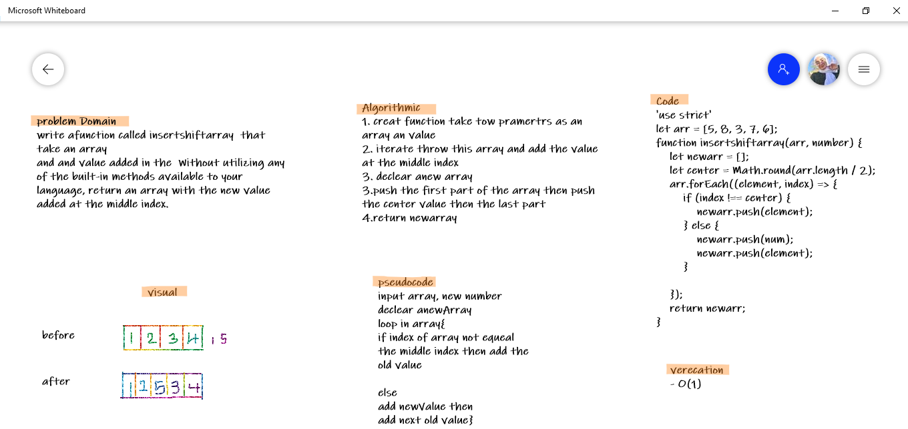

# Insert to Middle of an Array
<!-- Description of the challenge -->
write afunction called insertshiftarray  that take an array
and and value added in the  Without utilizing any of the built-in methods available to your language, return an array with the new value added at the middle index.

## Whiteboard Process

## Approach & Efficiency
<!-- What approach did you take? Discuss Why. What is the Big O space/time for this approach? -->
1. creat function take tow pramertrs as an array an value
2. iterate throw this array and add the value at the middle index
3. declear anew array
3.push the first part of the array then push the center value then the last part 
4.return newarray

**O(1)**
