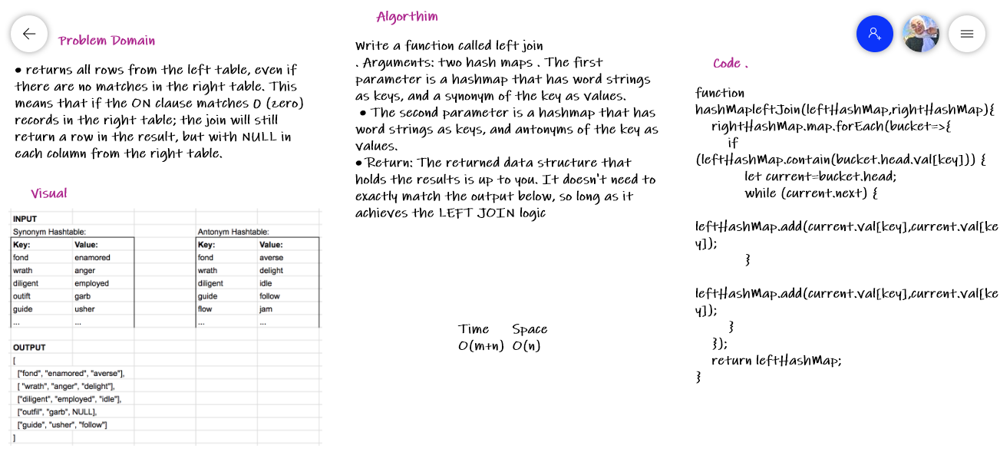

# Hashmap LEFT JOIN
<!-- Short summary or background information -->
Write a function that LEFT JOINs two hashmaps into a single data structure.

Write a function called left join
Arguments: two hash maps
The first parameter is a hashmap that has word strings as keys, and a synonym of the key as values.
The second parameter is a hashmap that has word strings as keys, and antonyms of the key as values.
Return: The returned data structure that holds the results is up to you. It doesn’t need to exactly match the output below, so long as it achieves the LEFT JOIN logic

## Challenge
<!-- Description of the challenge -->

## Approach & Efficiency
<!-- What approach did you take? Why? What is the Big O space/time for this approach? -->
Write a function called left join
. Arguments: two hash maps . The first parameter is a hashmap that has word strings as keys, and a synonym of the key as values.
 • The second parameter is a hashmap that has word strings as keys, and antonyms of the key as values.
• Return: The returned data structure that holds the results is up to you. It doesn't need to exactly match the output below, so long as it achieves the LEFT JOIN logic

**Complixty**
Time	Space
O(m+n)	O(n)
