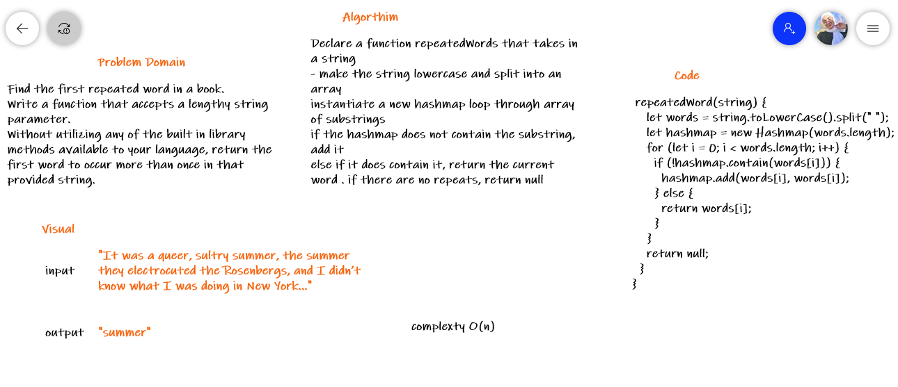

# Challenge Summary
<!-- Description of the challenge -->
Find the first repeated word in a string

Given a string, Find the 1st repeated word in a string
Examples

```
Input : "Ravi had been saying that he had been there"
Output : had

Input : "Ravi had been saying that"
Output : No Repetition

Input : "he had had he"
Output : he

```

## Whiteboard Process
<!-- Embedded whiteboard image -->


## Approach & Efficiency
<!-- What approach did you take? Why? What is the Big O space/time for this approach? -->
Declare a function repeatedWords that takes in a string
make the string lowercase and split into an array
instantiate a new hashmap loop through array of substrings
if the hashmap does not contain the substring, add it
else if it does contain it, return the current word . if there are no repeats, return null

**complexty O(n)**

## Solution
<!-- Show how to run your code, and examples of it in action -->