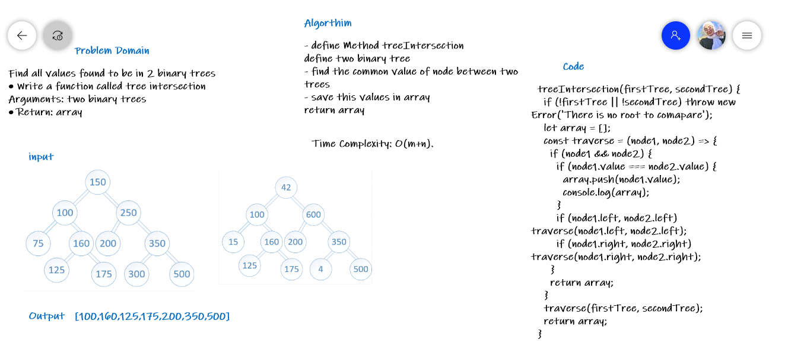

# Challenge Summary
<!-- Description of the challenge -->
Find all values found to be in 2 binary trees

Write a function called tree intersection
Arguments: two binary trees
Return: array

- define Method treeIntersection
- define two binary tree
- find the common value of node between two trees
- save this values in array
- return array

## Whiteboard Process
<!-- Embedded whiteboard image -->

## Approach & Efficiency
<!-- What approach did you take? Why? What is the Big O space/time for this approach? -->
 (Simple Solution) A simple way is to one by once search every node of first tree in second tree. Time complexity of this solution is O(m * h) where m is number of nodes in first tree and h is height of second tree.
**Time Complexity: O(m+n)**
