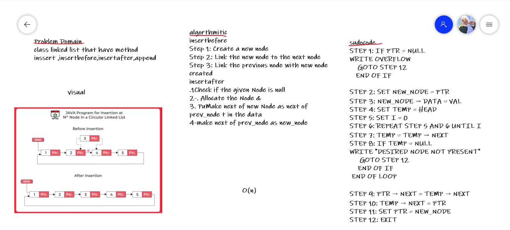

# Challenge Summary
<!-- Description of the challenge -->
**insertbefore**
Step 1: Create a new node
Step 2: Link the new node to the next node
Step 3: Link the previous node with new node created
**insertafter**
.1Check if the given Node is null 
2-. Allocate the Node &
3. PuMake next of new Node as next of prev_node t in the data
4-make next of prev_node as new_node
## Whiteboard Process
<!-- Embedded whiteboard image -->

## Approach & Efficiency
<!-- What approach did you take? Why? What is the Big O space/time for this approach? -->
this algorithm to add value after specific value or before that take the same time with origanal array becuase i need while loop to determine the value

 Big O(n)

