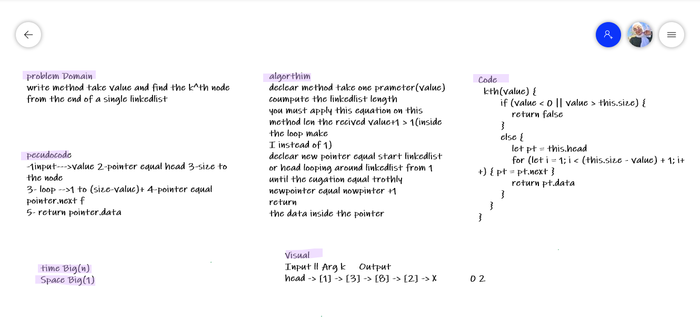

# Challenge Summary
<!-- Description of the challenge -->
write method take value and find the k^th node from the end of a single linkedlist
## Whiteboard Process
<!-- Embedded whiteboard image -->

## Approach & Efficiency
<!-- What approach did you take? Why? What is the Big O space/time for this approach? -->
A class was created along with the methods

takes a number k, as a parameter. Return the node’s value that is k from the end of the linked list.
For example, if the input is below list and n = 3, then output is “B”

time Big O(n) space Big O(1)