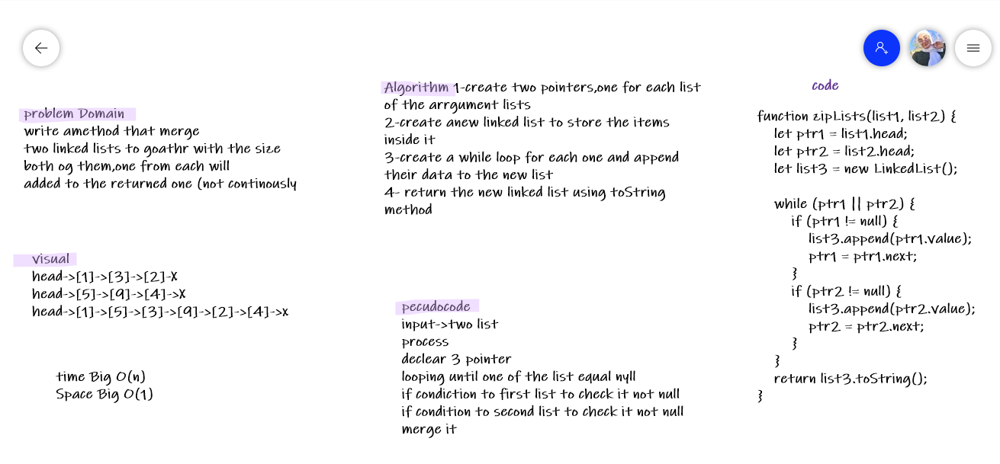

# Challenge Summary
<!-- Description of the challenge -->
write amethod that merge
two linked lists to goathr with the size
both og them,one from each will
added to the returned one (not continously

## Whiteboard Process
<!-- Embedded whiteboard image -->

## Approach & Efficiency
<!-- What approach did you take? Why? What is the Big O space/time for this approach? -->

* create two pointers,one for each list of the arrgument lists
* create anew linked list to store the items inside it
* create a while loop for each one and append their data to the new list
* return the new linked list using toString method

**time Big O(n)**

**Space Big O(1)**

