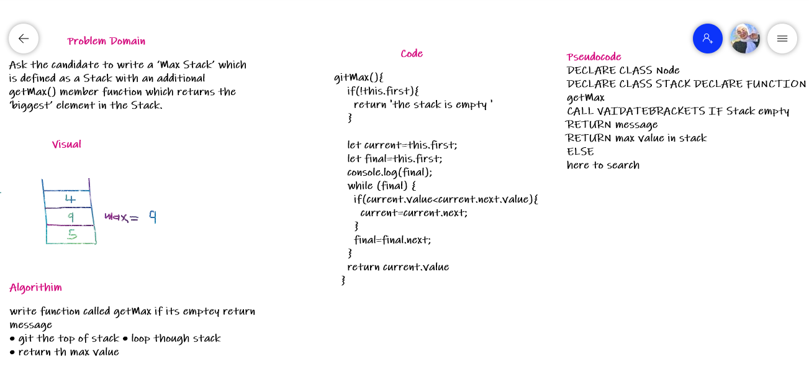

# Challenge Summary
<!-- Description of the challenge -->
Max stack. Write a method that returns the “biggest” element in a stack.

Ask the candidate to write a ‘Max Stack’ which is defined as a Stack with an additional getMax() member function which returns the ‘biggest’ element in the Stack.
The candidate can assume that only numeric values will be stored in the Stack, but she/he has to ask before the interviewer can state this.
The internal memory of the Stack can be approached in different wa

## Whiteboard Process
<!-- Embedded whiteboard image -->

## Approach & Efficiency
<!-- What approach did you take? Why? What is the Big O space/time for this approach? -->

write function called getMax if its emptey return message

-  git the top of stack 
- loop though stack
-  return th max value

 O(1) means that it takes a constant time

