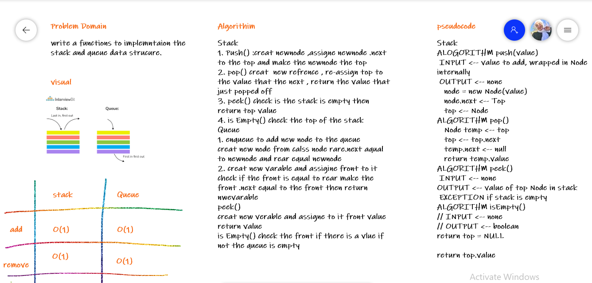

# Stacks and Queues
<!-- Short summary or background information -->
- stack :A stack is a data structure that consists of Nodes. Each Node references the next Node in the stack, but does not reference its previous.

**FILO**

First In Last Out
This means that the first item added in the stack will be the last item popped out of the stack.

**LIFO**

Last In First Out
This means that the last item added to the stack will be the first item popped out of the stack.

- Queue: 

**FIFO**

First In First Out
This means that the first item in the queue will be the first item out of the queue.

**LILO**

Last In Last Out
This means that the last item in the queue will be the last item out of the queue.
## Challenge
<!-- Description of the challenge -->
stack and queue implemntation
## Approach & Efficiency
<!-- What approach did you take? Why? What is the Big O space/time for this approach? -->
- write the implemntation 
- write the test 
- write the whitebord
- write the test and testing 
Efficiencey O(1)

## API
<!-- Description of each method publicly available to your Stack and Queue-->

