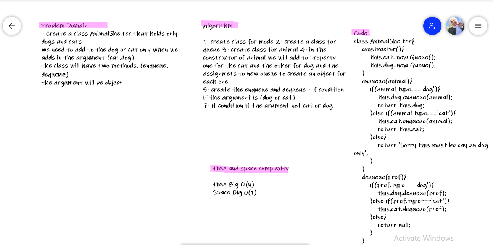

# Challenge Summary
<!-- Description of the challenge -->
Create a class called AnimalShelter which holds only dogs and cats.
The shelter operates using a first-in, first-out approach.
Implement the following methods:
enqueue
Arguments: animal
animal can be either a dog or a cat object.
dequeue
Arguments: pref
pref can be either "dog" or "cat"
Return: either a dog or a cat, based on preference.
If pref is not "dog" or "cat" then return null.
## Whiteboard Process
<!-- Embedded whiteboard image -->

## Approach & Efficiency
<!-- What approach did you take? Why? What is the Big O space/time for this approach? -->
1- create class for mode 2- create a class for queue 3- create class for animal 4- in the constructor of animal we will add to property
one for the cat and the other for dog and the assignmets to new queue to create an object for each one
5- create the enqueue and dequeue - if condition if the argument is (dog or cat) 
7- if condition if the arument not cat or dog

**enqueue:**

Time: O(1)
Space: O(1)
**dequeue:**

Time: O(n)
Space: O(n)

**enqueue(animal)**: add object into the AnimalShelter, using a lastin last out approach.

**dequeue(pref)**: Removes the object from the front of the AnimalShelter