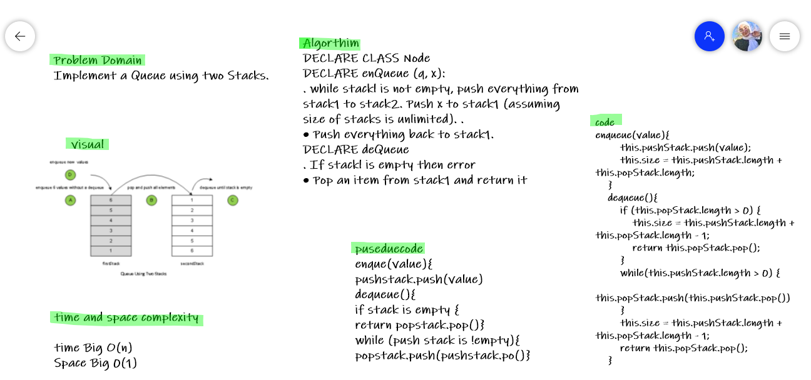

# Challenge Summary
<!-- Description of the challenge -->
Implement a Queue using two Stacks.
## Whiteboard Process
<!-- Embedded whiteboard image -->

## Approach & Efficiency
<!-- What approach did you take? Why? What is the Big O space/time for this approach? -->

**stack**

push(value) : adds a new node with that value to the top of the stack with an O(1) Time performance.
pop() : Removes the node from the top of the stack
peek() : Returns the Value of the node located at the top of the stack
isEmpty() : Returns a boolean indicating whether or not the stack is empty.

**queue**

enqueue(value) : adds a new node with that value to the back of the queue
with an O(1) Time performance.
dequeue() : Removes the node from the front of the queue
peek() : Returns the Value of the node located at the front of the queue
isEmpty() : Returns a boolean indicating whether or not the queue is empty
**Time Complexity:**

- Push operation : O(1).

- Pop operation : O(N).

- Auxiliary Space: O(N).

## Solution
<!-- Show how to run your code, and examples of it in action -->

The idea, in order to implement a queue,
 is to internally reverse the order of the elements of the stack.
 We do this by using anoher stack.