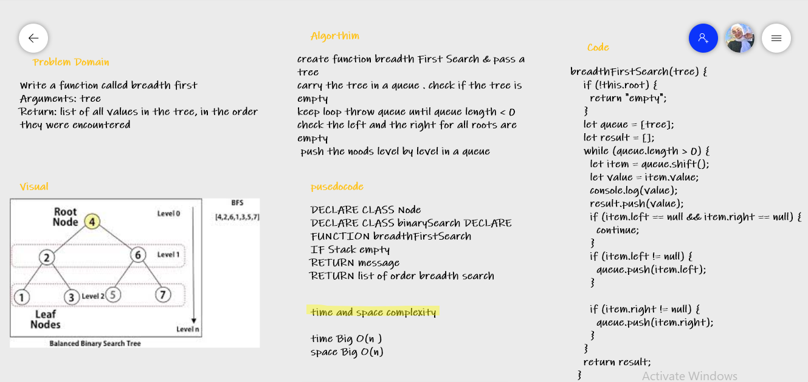

# Challenge Summary
<!-- Description of the challenge -->
Write a function called breadth first
Arguments: tree
Return: list of all values in the tree, in the order they were encountered

* returns a list of all values in the tree level by level

## Whiteboard Process
<!-- Embedded whiteboard image -->

## Approach & Efficiency
<!-- What approach did you take? Why? What is the Big O space/time for this approach? -->
create function breadth First Search & pass a tree
carry the tree in a queue . check if the tree is empty
keep loop throw queue until queue length < 0  check the left and the right for all roots are empty 
 push the noods level by level in a queue

* time and space complexity

* time Big O(n )
* space Big O(n)

<!-- Show how to run your code, and examples of it in action -->