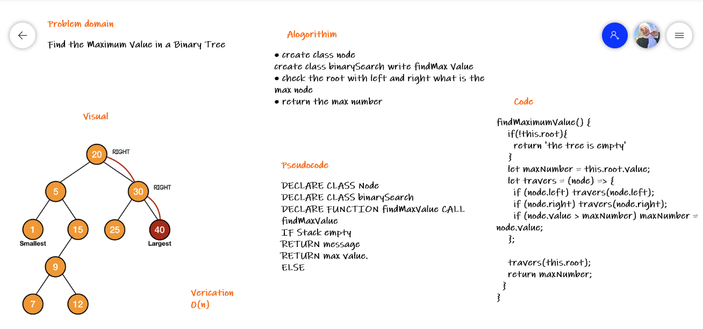

# Challenge Summary
<!-- Description of the challenge -->
Find the Maximum Value in a Binary Tree

find maximum value
Arguments: none
Returns: number
Find the maximum value stored in the tree. You can assume that the values stored in the Binary Tree will be numeric.

## Whiteboard Process
<!-- Embedded whiteboard image -->

## Approach & Efficiency
<!-- What approach did you take? Why? What is the Big O space/time for this approach? -->

* create class node
* create class binarySearch write findMax Value
* check the root with left and right what is the max node
* return the max number

### Time Complexity

Push operation : O(1).

Pop operation : O(N).

Auxiliary Space: O(N).
