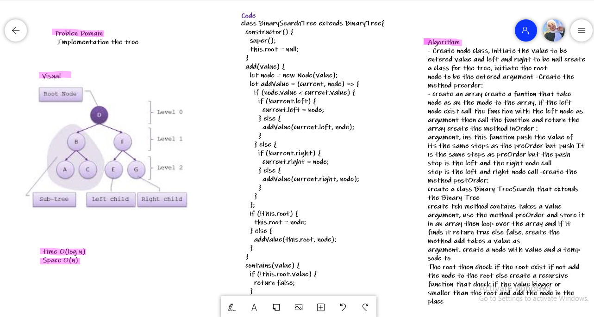

# Challenge Summary

Create a Node class that has properties for the value stored in the node, the left child node, and the right child node.
## Whiteboard Process


## Approach & Efficiency


Binary Search Tree
Create a Binary Search Tree class
This class should be a sub-class (or your languages equivalent) of the Binary Tree Class, with the following additional methods:
Add
Arguments: value
Return: nothing
Adds a new node with that value in the correct location in the binary search tree.
Contains
Argument: value
Returns: boolean indicating whether or not the value is in the tree at least once.

**Binary Tree :**

```
   preOder() : Root -> Left -> Right
   postOrder() : Left -> Right -> Root
   inPrder() : Left -> Root -> Right
```

**Binary Search Tree:**

```
addValue(value) : add value to the tree

contains(value) : check if the tree contains this value at least one time.
```

**BinaryTree :**

* preOrder() time : O(log n) , space O(n)
* inOrder() time : O(log n) , space O(n)
* postOrder() time : O(log n) , space O(n)

**BinarySearchTree :**
* contains(value) : time : O(n) , space O(n)
* add(value) : time O(n), spaceO(n)